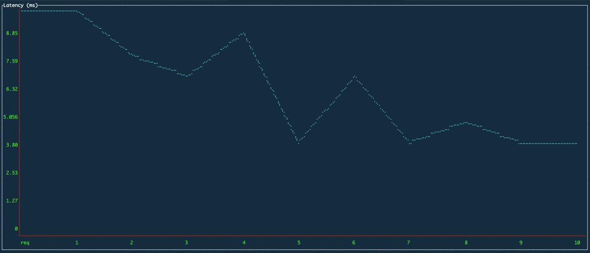

# ali

Another load testing tool, inspired by [vegeta](https://github.com/tsenart/vegeta) and [jplot](https://github.com/rs/jplot).

`ali` comes with a simple terminal based UI, lets you generate HTTP requests and plot the results in real-time.
With it, real-time analysis can be performed on the terminal.

## Installation

Executables are available through the [releases page](https://github.com/nakabonne/ali/releases).

## Usage
### Quickstart
Give the target URL and press Enter, then the attack will be launched with default options.

### Options

#### Rate Limit

The request rate per time unit to issue against the targets.
Give 0 then it will send requests as fast as possible.

#### Duration
The amount of time to issue requests to the targets. Give `0s` for an infinite attack. Press `Ctrl-C` to stop.
Valid time units are "ns", "us" (or "µs"), "ms", "s", "m", "h". Default is `10s`.

#### Timeout
The timeout for each request. `0s` means to disable timeouts.

**Method**

**Header**

**Body**

## Features

### Plot in real-time
Currently it only plots latencies, but in the near future more metrics will be drawn as well.

### Visualize the attack progress
This will help you during long tests.

### Mouse support
With the help of [mum4k/termdash](https://github.com/mum4k/termdash), intuitive operation is supported.

## Built with
- [mum4k/termdash](https://github.com/mum4k/termdash)
  - [nsf/termbox-go](https://github.com/nsf/termbox-go)
- [tsenart/vegeta](https://github.com/tsenart/vegeta)

## LoadMap
- Plot more metrics in real-time ([#2](https://github.com/nakabonne/ali/issues/2))
- Support more options for HTTP requests ([#1](https://github.com/nakabonne/ali/issues/1))
- Better UI
